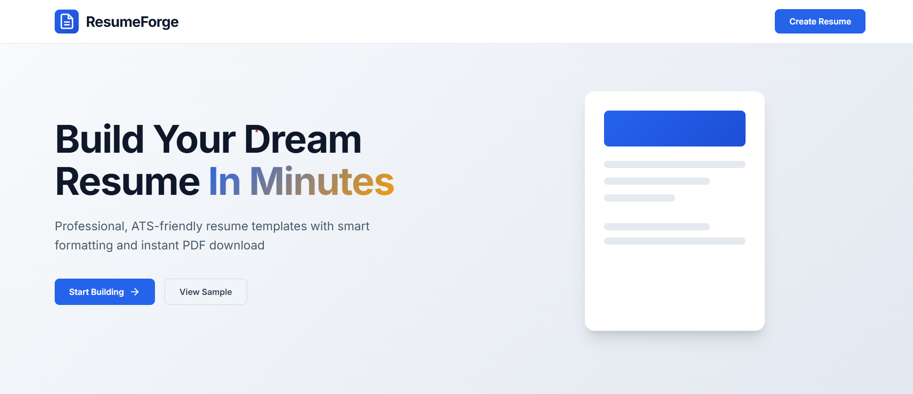

# 📄 ResumeForge — Modern Resume Builder

**ResumeForge** is a sleek, modern, and interactive resume builder that allows users to create professional, ATS-friendly resumes in minutes. It supports real-time editing, live preview, and one-click PDF download.

---

## 🚀 Live Demo

👉 [View Live Demo](https://deenprasath.github.io/ResumeBuilder/)
  
_Replace the above URL with your actual deployed link (e.g., GitHub Pages, Vercel, Netlify)_

---

## ✨ Features

- 💡 User-friendly interface with a smooth design
- 📝 Section-based resume input (Personal Info, Summary, Experience, Education, Skills, Projects)
- 🖥️ Real-time preview of your resume
- 📥 Download resume as a formatted PDF
- 📱 Responsive design

---

## 🛠 Technologies Used

- **HTML5** + **CSS3** + **JavaScript (Vanilla)**
- **jsPDF** for generating downloadable PDFs
- **Google Fonts** for beautiful typography
- Responsive CSS grid and Flexbox layout

